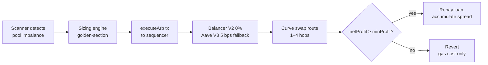

# Kingfisher

_Atomic flash-loan arbitrage and liquidation engine for Curve stablecoin pools on Arbitrum One._

[](https://github.com/Xtley001/kingfisher/actions)
[](./LICENSE)
[](https://arbiscan.io)
[](https://www.rust-lang.org)

Kingfisher captures StableSwap price discrepancies across Curve pools on Arbitrum One via uncollateralized flash loans. The engine prioritizes zero-fee borrowing via Balancer V2 with automated fallback to Aave V3 (5 bps). Every trade executes atomically in a single transaction guarded by on-chain profit validation (`require(netProfit >= minProfit)`); failing or uncompetitive trades revert and consume only gas, ensuring zero capital risk. For complete economic mechanics and execution details, see the [strategy specification](./docs/STRATEGY.md).

## Quickstart

```bash
# Clone and configure
git clone https://github.com/Xtley001/kingfisher.git
cd kingfisher
cp .env.example .env.testnet

# Run bot engine on Arbitrum Sepolia testnet
cd bot && NETWORK=testnet cargo run --bin kingfisher

# Deploy contracts via Foundry (testnet)
cd ../contracts && forge script script/DeployTestnet.s.sol --rpc-url $RPC_HTTP_URL --broadcast -vvvv

# Start operator dashboard
cd ../dashboard && npm install && npm run dev
```

## Architecture

```
kingfisher/
├── contracts/            # Solidity flash-loan arbitrageurs and Foundry tests
├── bot/                  # Multi-crate asynchronous Rust searcher engine
│   ├── bin/              # Binary entrypoint and execution coordinator
│   └── crates/
│       ├── core/         # Shared domain types, pool definitions, and in-memory state
│       ├── chain/        # Local Nitro IPC / WebSocket block ingestion and event indexing
│       ├── scanner/      # 5-layer opportunity filter and directed route graph
│       ├── simulation/   # StableSwap analytical math, golden-section sizing, eth_call checks
│       ├── edges/        # Structural edge monitors (LLAMMA, peg stress, cascade, LP exits)
│       ├── executor/     # Calldata cache, presigned gas pool, and Timeboost routing
│       └── api/          # Axum REST API, WebSocket streams, and Prometheus metrics
├── dashboard/            # React 18, TypeScript, and Vite monitoring interface
├── deploy/               # Systemd service unit for bare-metal co-location
└── docs/                 # Extended system specifications and operational runbooks
```



Arbitrum One operates a single sequencer with no public mempool and first-come-first-served (FCFS) ordering, eliminating frontrunning and sandwich attacks. Kingfisher broadcasts transactions directly to the sequencer or through Arbitrum Timeboost express-lane auctions for sub-block priority sequencing. For detailed system design and performance specifications, see [ARCHITECTURE.md](./docs/ARCHITECTURE.md).

## Supported Pools & Venues

| Pool | Coins | Type | Flash Venue | Priority |
|---|---|---|---|---|
| `crvUSD-USDC` | crvUSD, USDC | Plain (2 coins) | Balancer V2 / Aave V3 | 1 (Active) |
| `crvUSD-USDT` | crvUSD, USDT | Plain (2 coins) | Balancer V2 / Aave V3 | 1 (Active) |
| `2pool` | USDC, USDT | Plain (2 coins) | Balancer V2 / Aave V3 | 1 (Active) |
| `FRAX-USDC` | FRAX, USDC | Plain (2 coins) | Balancer V2 / Aave V3 | 1 (Active) |

## Configuration

All configuration is managed through environment variables — see [`.env.example`](./.env.example) for defaults:

| Variable | Description | Default |
|---|---|---|
| `NETWORK` | Execution environment (`testnet`, `mainnet`) | `testnet` |
| `MIN_PROFIT_USD` | Absolute profit floor in USD | `10` |
| `MIN_GAS_ROI` | Minimum return on gas multiple (e.g., 3.0 = 300%) | `3.0` |
| `ABS_CAP_USD` | Flash-loan borrow ceiling | `5000000` |
| `L1_BASE_FEE_GWEI` | Baseline Ethereum L1 fee for Arbitrum data costs | `10` |
| `TIMEBOOST_EXPRESS_LANE_URL` | Optional Arbitrum Timeboost priority endpoint | — |

Runtime thresholds (such as profit floors and sizing ceilings) can be adjusted dynamically via the operator dashboard or `POST /params` without process restarts.

## Testing

```bash
# Run full Rust workspace test suite
cd bot && cargo test --all

# Run contract unit and mainnet fork tests
cd contracts && forge test -vvvv
```

For complete test protocols, local Anvil fork simulations, and pre-production verification checklists, see [TESTING.md](./docs/TESTING.md).

## Operations

For server deployment checklists, gas refill protocols, circuit breakers, and incident recovery runbooks, see the [Operations Manual](./docs/OPS_MANUAL.md).

## Security

Every trade executes with an on-chain profit assertion (`require(netProfit >= minProfit)`), dual callback authentication (`IBalancerVault` / `IAavePool`), and strict separation between the operator hot wallet and cold owner address. Report vulnerabilities per our [security policy](./SECURITY.md). This software is unaudited — do not commit substantial capital without independent verification.

## Contributing

See [CONTRIBUTING.md](./CONTRIBUTING.md) for development setup, pool addition procedures, and PR guidelines.

## License

Released under the [MIT License](./LICENSE).
