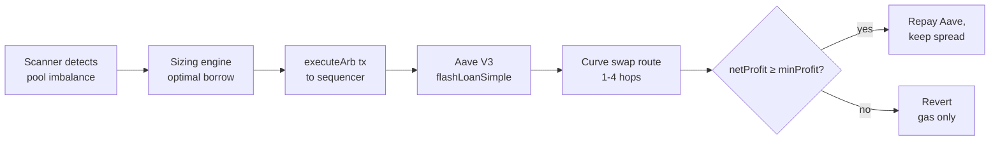

# Kingfisher 🦅

Flash-loan arbitrage bot for Curve stablecoin pools on Arbitrum One.

[](https://github.com/Xtley001/kingfisher/actions)
[](./LICENSE)
[](https://arbiscan.io)

Kingfisher borrows stablecoins from Aave V3, captures the StableSwap price spread between two imbalanced Curve pools, and repays atomically in a single transaction. Every trade is guarded on-chain by `require(netProfit >= minProfit)` — a losing race reverts and costs only gas, so principal is never at risk. For the strategy, edge sources, execution model, and an honest profitability analysis, see the [strategy doc](./docs/STRATEGY.md).

## Stack

| Layer | Technology |
|---|---|
| On-chain | Solidity · Foundry · Aave V3 · Curve |
| Bot engine | Rust · alloy-rs · tokio · rayon |
| Dashboard | React 18 · TypeScript · Vite |
| Hosting | Bare-metal (systemd) near the Arbitrum sequencer; dashboard on any static host |

## How a trade works



Arbitrum has a single sequencer and no public mempool, so there is no Flashbots relay and nothing can sandwich an atomic arb. Kingfisher broadcasts a signed transaction straight to the lowest-latency sequencer endpoint; ordering priority comes from Arbitrum Timeboost, not private order flow. See [docs/STRATEGY.md](./docs/STRATEGY.md#execution-and-latency).

## Quickstart

Build and run the bot against testnet:

```bash
cp .env.example .env.testnet          # fill RPC_WS_URL, RPC_HTTP_URL, BOT_PRIVATE_KEY, ARBISCAN_KEY, API_KEY
cd bot && NETWORK=testnet cargo run --bin kingfisher
```

Deploy the contract (testnet first):

```bash
cd contracts
forge install foundry-rs/forge-std --no-git
forge install aave/aave-v3-core --no-git
forge install OpenZeppelin/openzeppelin-contracts --no-git
forge script script/DeployTestnet.s.sol --rpc-url $RPC_HTTP_URL --broadcast --verify -vvvv
```

Run the dashboard:

```bash
cd dashboard && npm install && npm run dev   # http://localhost:5173
```

## Production deployment

Kingfisher runs on a dedicated/bare-metal server co-located near the Arbitrum sequencer, ideally alongside a local Nitro node for IPC (~0.1 ms block latency). Build with `cargo build --release --features ipc` and install the systemd unit in [`deploy/kingfisher.service`](./deploy/kingfisher.service). Secrets live only in `/etc/kingfisher/kingfisher.env` (`chmod 600`), never in the repo. The full sequenced checklist is in [`LAUNCH_ROADMAP.md`](./LAUNCH_ROADMAP.md).

## Architecture

See [`ARCHITECTURE.md`](./ARCHITECTURE.md) for the full system design. The bot is a Rust workspace:

```
kingfisher/
├── contracts/            Solidity — KingfisherArb.sol + Foundry tests
├── bot/                  Rust workspace
│   └── crates/
│       ├── core/         Shared types, config, state
│       ├── chain/        Block loop (IPC/WS) + multicall state fetcher
│       ├── scanner/      5-layer filter + route graph
│       ├── simulation/   StableSwap math + optimal sizing + eth_call validation
│       ├── edges/        Structural edge monitors (LLAMMA, peg stress, etc.)
│       ├── executor/     Calldata builder + Arbitrum sequencer submission
│       └── api/          Axum REST + WebSocket + Telegram alerts
├── dashboard/            React 18 + TypeScript PWA
└── deploy/               systemd unit for bare-metal deployment
```

## Deployed contracts

| Network | Contract | Address |
|---|---|---|
| Arbitrum One | `KingfisherArb` | `0x…` (filled after mainnet deploy) |
| Arbitrum Sepolia | `KingfisherArb` | `0x…` (filled after testnet deploy) |

## Configuration

All configuration is via environment variables — see [`.env.example`](./.env.example) for the full list. Key parameters:

| Variable | Description | Default |
|---|---|---|
| `NETWORK` | `mainnet` or `testnet` | `testnet` |
| `MIN_PROFIT_USD` | Absolute profit floor | `10` |
| `MIN_GAS_ROI` | Minimum ROI multiple on gas | `3.0` |
| `ABS_CAP_USD` | Maximum flash-loan size | `5000000` |
| `L1_BASE_FEE_GWEI` | Ethereum L1 base fee for the Arbitrum L1 gas model | `10` |
| `TIMEBOOST_EXPRESS_LANE_URL` | Optional Timeboost priority endpoint | — |

Live parameters (profit floor, sizing cap) are tunable via the dashboard or `POST /params` without a restart.

## Testing

```bash
cd bot && cargo test --all                                # Rust unit tests
cd contracts && forge test --fork-url $RPC_HTTP_URL -vvvv  # Foundry fork tests
```

The full deploy and upgrade protocol is in [`docs/TESTING.md`](./docs/TESTING.md).

## Security

Every trade is bounded by an on-chain profit guard, and the contract separates a cold owner wallet from the hot operator wallet. Report vulnerabilities per the [security policy](./SECURITY.md). This code has not been independently audited — do not deploy significant capital without your own review.

## Contributing

See [`CONTRIBUTING.md`](./CONTRIBUTING.md) for dev setup, the pool-approval process, and PR guidelines.

## License

Released under the [MIT License](./LICENSE).
