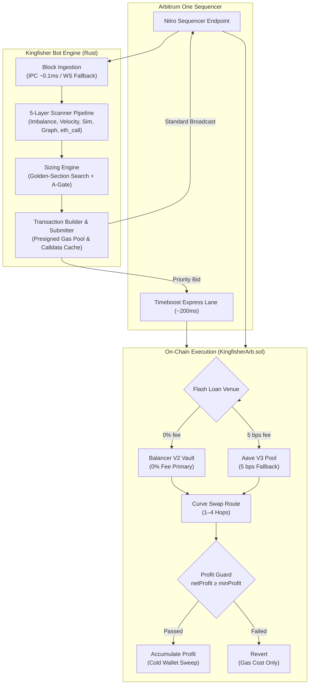

# Architecture

_Comprehensive technical architecture, subsystem design, and performance model for Kingfisher on Arbitrum One._

## System Architecture



```
kingfisher/
├── contracts/            # Solidity flash-loan arbitrageurs, interfaces, Foundry tests
├── bot/                  # Multi-crate asynchronous Rust workspace
│   ├── bin/              # Binary entrypoint and lifecycle orchestrator
│   └── crates/
│       ├── core/         # Shared types, pool/token configs, state machine
│       ├── chain/        # IPC/WS block ingestion, multicall fetcher, event indexing
│       ├── scanner/      # 5-layer opportunity filter and directed route graph
│       ├── simulation/   # StableSwap math, golden-section sizing, eth_call validation
│       ├── edges/        # Structural edge monitors (LLAMMA, peg stress, cascade, LP exits)
│       ├── executor/     # Calldata encoder, presigned gas pool, Timeboost submission
│       ├── oracle_lag/   # Chainlink/Pyth price deviation and venue resolution
│       └── api/          # Axum REST API, WebSocket streams, Prometheus metrics
├── dashboard/            # React 18, TypeScript, and Vite monitoring PWA
└── deploy/               # Systemd unit configuration for bare-metal co-location
```

## Crate Responsibilities

- **`kingfisher-core`**: Core data models, environment configuration, pool configurations, and shared in-memory state (`BotState`). Implements thread-safe accessors via `tokio::sync::RwLock`.
- **`kingfisher-chain`**: Real-time event and block stream ingestion. Prefers a local Unix domain socket IPC connection (~0.1ms latency) to an Arbitrum Nitro node, falling back to WebSocket. Handles batch contract state queries via multicall and Chainlink oracle monitoring.
- **`kingfisher-scanner`**: Hierarchical 5-layer filter pipeline. Evaluates candidate pool pairs, prune unviable routes early, and computes directed multi-hop paths across Curve pools.
- **`kingfisher-simulation`**: High-performance algebraic model of the Curve StableSwap invariant ($A \cdot n^n \sum x_i + D = A \cdot D \cdot n^n + \frac{D^{n+1}}{n^n \prod x_i}$). Executes golden-section search for optimal borrow sizing without RPC round-trips, and runs asynchronous `eth_call` validation checks.
- **`kingfisher-edges`**: Specialized triggers monitoring off-center structural conditions: Curve LLAMMA liquidation bands, stablecoin peg deviations (USDC/USDT), LP liquidity withdrawals, gauge vote windows, and factory pool deployment events.
- **`kingfisher-executor`**: Calldata assembly, block-scoped calldata caching, pre-signed gas envelopes, and submission routing. Dispatches transactions via `executeArbBalancer` (0% fee) or `executeArb` (Aave fallback), evaluating dynamic Timeboost priority auctions.
- **`kingfisher-oracle_lag`**: Cross-venue price monitoring between centralized feeds (Pyth, Chainlink) and DEX pool states to detect pending pricing updates.
- **`kingfisher-api`**: Control plane exposing REST endpoints, WebSocket feeds, and Prometheus metrics for dashboard interaction and automated operations.

## 5-Layer Scanner Pipeline

Every block triggers an evaluation of configured token pairs through five sequential filtration stages:

| Layer | Stage | Evaluated Metric | Rejection Condition |
|---|---|---|---|
| L1 | Imbalance Filter | Balance divergence `\|balance_ratio - 1.0\|` | `< MIN_IMBALANCE_PCT` (default: 5.0%) |
| L2 | Velocity Filter | Single-block imbalance change ($\Delta$) | `< MIN_VELOCITY` (default: 0.015, filters stale states) |
| L3 | Algebraic Simulation | Fast-path analytical net profit calculation | `net_profit < effective_min_profit` |
| L4 | Route Graph Search | Multi-hop DFS traversal across candidate pools | No viable profitable cycle found |
| L5 | RPC Validation | Divergence between algebraic model and `eth_call` | `divergence > 0.1%` (triggers auto-pause) |

In calm market regimes, Layers 1 and 2 eliminate more than 90% of candidate pairs before mathematical simulation executes.

## Sizing Engine

Optimal borrow amounts are determined through bounded one-dimensional optimization:

1. **Concave Profit Objective**: For any pair of Curve StableSwap pools with divergent virtual prices, net profit $P(x) = \text{Output}(x) - x - \text{LoanFee}(x) - \text{GasCost}$ forms a concave function that ascends to a unique global maximum before price impact degrades margins.
2. **Golden-Section Search**: Evaluates the interval $[x_{\min}, \text{ABS\_CAP\_USD}]$ using golden-section optimization. Converges to the global optimum within 40–50 iterations (<300µs total compute) without derivative calculations.
3. **Dual-Leg A-Parameter Gate**: Assesses pool amplification parameters ($A$) on both input and output pools to ensure price impact does not exceed configured safety bounds.
4. **Cap Enforcement**: Final borrow size is constrained by `min(optimum, ABS_CAP_USD, HARD_CAP_USD)`, where `HARD_CAP_USD = $25,000,000` is a compile-time safety ceiling.

## Edge Monitors

- **LLAMMA Monitor (`edges/src/llamma.rs`)**: Observes Curve LLAMMA soft-liquidation bands approaching active market prices. Continuous band liquidations reliably induce transient stablecoin imbalances in secondary pools.
- **Peg Stress Monitor (`edges/src/peg_stress.rs`)**: Tracks Chainlink reference feeds for USDC and USDT. Divergence exceeding 0.25% triggers stress regime: all secondary pools activate, sizing shifts to aggressive templates, and alert notifications dispatch. Hysteresis (0.15% recovery band) prevents flapping.
- **LP Removal Monitor (`edges/src/lp_removal.rs`)**: Tracks large liquidity burn events (`RemoveLiquidity`, `RemoveLiquidityOne`) that create immediate inventory gaps.
- **Cascade Monitor (`edges/src/cascade.rs`)**: Detects cross-pool transmission where stress in 2pool propagates to dependent meta-pools (e.g., FRAXBP, crvUSD pools).
- **Gauge Vote Monitor (`edges/src/gauge_vote.rs`)**: Watches bi-weekly Curve DAO gauge vote weight shifts to identify anticipated liquidity migration before execution.

## Performance & Latency Targets

| Path | Target p99 | Description |
|---|---|---|
| IPC Connection | < 0.1 ms | Co-located Arbitrum Nitro node over local Unix domain socket |
| WebSocket Connection | < 250 ms | External RPC endpoint fallback (Alchemy / QuickNode) |
| Pipeline Runtime | < 1.0 ms | End-to-end scanner, simulation, and sizing decision |
| Sizing Optimization | < 300 µs | Golden-section search convergence (40–50 iterations) |
| Transaction Construction | < 50 µs | Calldata encoding via pre-allocated buffers and cache |

## Gas Model & L1 Calldata Accounting

On Arbitrum One, total transaction cost is heavily dominated by L1 calldata posting rather than L2 virtual machine execution. Kingfisher explicitly accounts for this:

$$C_{\text{tx}} = (\text{GasUsed}_{\text{L2}} \cdot P_{\text{L2}}) + (\text{CalldataBytes} \cdot P_{\text{L1\_base}} \cdot 16)$$

| Route Type | L2 Gas Target | Hop Limit | Notes |
|---|---|---|---|
| 2-Hop Arbitrage | < 400,000 | 2 pools | Direct pair swap (e.g., 2pool &rarr; crvUSD-USDC) |
| 3-Hop Arbitrage | < 550,000 | 3 pools | Tri-pool cycle |
| 4-Hop Arbitrage | < 700,000 | 4 pools | Meta-pool underlying exchange traversals |

`L1_BASE_FEE_GWEI` parameterizes the L1 calldata estimate at runtime, preventing the submission of trades that appear profitable on L2 alone but yield net losses after data availability posting.

## Connection Architecture: IPC vs RPC

| Connection | Latency | Capability | Deployment Target |
|---|---|---|---|
| Local IPC Socket | ~0.1 ms | Full local mempool, zero-latency block header notification | Production co-located bare metal |
| Dedicated WebSocket | 50–250 ms | Standard block subscription and event filtering | Cloud replica or staging node |
| HTTP RPC | 100–400 ms | Read-only simulation queries and fallback queries | Development and local testing |

To enable IPC in production builds:

```bash
cargo build --release --features ipc
```
